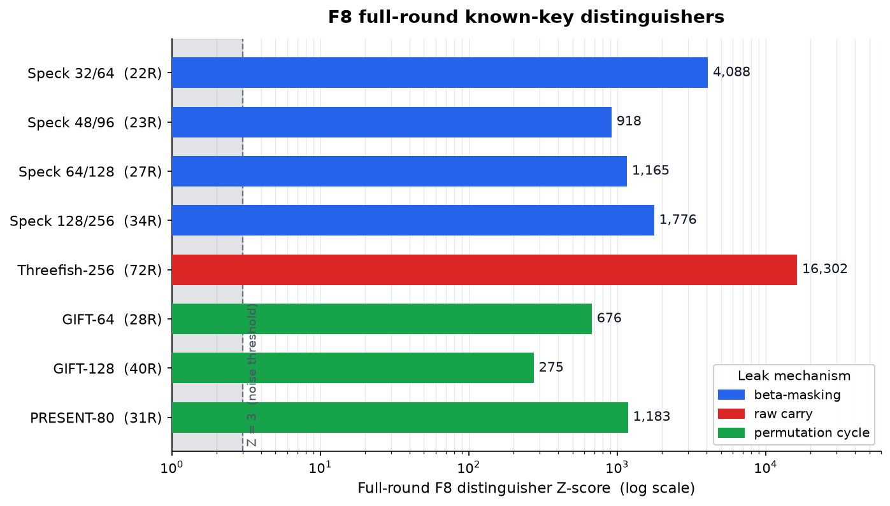
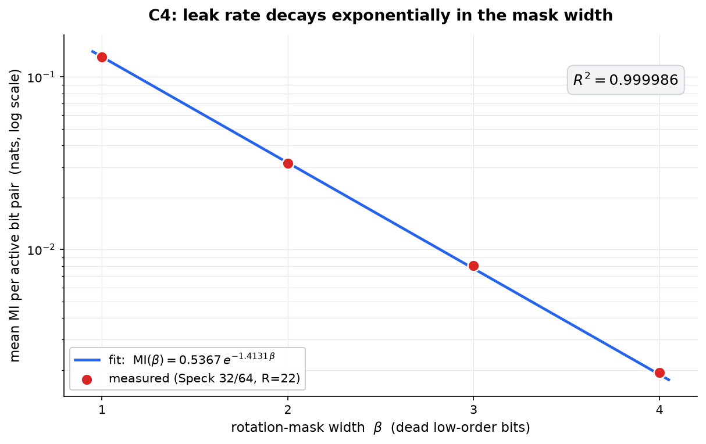

# F8 — Cross-Round Carry-Leak Distinguishers

**F8** is a cross-round mutual-information test that detects persistent carry leakage in block ciphers, and shows it surviving at **full round count** across four cipher families.

Author: **David Tom Foss** ([ORCID 0009-0004-0289-7154](https://orcid.org/0009-0004-0289-7154)) · david@foss.com.de

## The test

Generate the cipher output at round `R` and at round `R+1` with the **same key and counter**. XOR the two outputs, and measure the mutual information (MI) between the bits of the round-`R` output and the bits of that cross-round XOR difference. Score the observed MI against a permutation null to get a Z-score. A structural carry leak shows `Z >> 3` that **does not decay as more rounds are added**.

## Full-round distinguishers



| Cipher          | Rounds | Mechanism           | Z-score  | Script |
|-----------------|:------:|---------------------|---------:|--------|
| Speck 32/64     |   22   | β-masking           |  +4088   | `experiments/reproduce_core.py`, `experiments/speck_variants.py` |
| Speck 48/96     |   23   | β-masking           |   +918   | `experiments/speck_variants.py` |
| Speck 64/128    |   27   | β-masking           |  +1165   | `experiments/speck_variants.py` |
| Speck 128/256   |   34   | β-masking           |  +1776   | `experiments/speck_variants.py` |
| Threefish-256   |   72   | raw carry           | +16302   | `experiments/threefish256.py` |
| GIFT-64         |   28   | permutation cycle   |   +676   | `experiments/gift.py` |
| GIFT-128        |   40   | permutation cycle   |   +275   | `experiments/gift.py` |
| PRESENT-80      |   31   | permutation cycle   |  +1183   | `experiments/present.py` |

Speck Z-scores are the 3-seed mean (Speck 32/64) and the full-round encrypt-direction Z (other variants). Threefish-256 reaches MI = 0.6931 = ln 2 on bit 0, the information-theoretic maximum for a single bit. GIFT and PRESENT are verified against their official test vectors ([giftcipher/gift](https://github.com/giftcipher/gift); PRESENT CHES 2007) before the F8 scan runs.

## The F8 signal (Speck 32/64)

Six properties, all reproduced by `experiments/reproduce_core.py`:

- **C1 — Full-round distinguisher.** Speck 32/64 at R=22, mean Z = +4088 over 3 seeds.
- **C2 — No round decay.** MI is flat across R = 5…22 (spread 5.3 %); the leak rate is constant, it does not diffuse away with more rounds.
- **C3 — α-shifted diagonal.** The MI concentrates on the α-shifted output diagonal (diag / off-diag ratio ≈ 1350:1), with β dead bits at positions α … α+β−1.
- **C4 — Exponential leak-rate law.** MI(β) = A·exp(−B·β) with A = 0.5367, B = 1.4131, **R² = 0.999986**.
- **C5 — Encrypt-only.** Decryption drives Z to ≈ 0; the encrypt/decrypt ratio exceeds 10⁴:1.
- **C6 — Key-schedule independent.** The MI signal is identical (spread 1.7 %) with the real key schedule, an all-zero schedule, or random independent round keys — and every mode stays strongly distinguishing.



## The two mechanisms

1. **β-masking (Speck).** The `ROL(y, β)` in the round function masks the low β bits of the addition output. The remaining `ws − β` bits carry the addition's carry correlation uniformly, landing on the α-shifted diagonal.
2. **Raw carry + rotation-spread (Threefish-256).** The modular-addition output is exposed directly, so the low carry bit is fully determined across the round boundary (MI = ln 2 on bit 0). The cipher's own rotations then spread that carry correlation across all 64 bit positions.

For the SPN ciphers (GIFT, PRESENT), the same cross-round MI leak is driven by the cycle structure of the fixed bit permutation rather than by modular addition.

## Quick start

```bash
pip install -e .
python reproduce.py          # runs everything, prints the summary table (~1.5 min)
```

Run a single cipher directly:

```bash
python experiments/reproduce_core.py     # Speck 32/64, properties C1–C6
python experiments/speck_variants.py     # all 4 Speck variants, full round, encrypt/decrypt
python experiments/threefish256.py       # Threefish-256, 72 rounds
python experiments/gift.py               # GIFT-64 / GIFT-128
python experiments/present.py            # PRESENT-80
```

Each script writes a JSON result under `results/`. To regenerate the figures:

```bash
pip install -e ".[figures]"
python figures/make_figures.py
```

Dependencies: `numpy`, `scipy` (plus `matplotlib` for the figures). Every script is self-contained.

## License

MIT — see [LICENSE](LICENSE).
