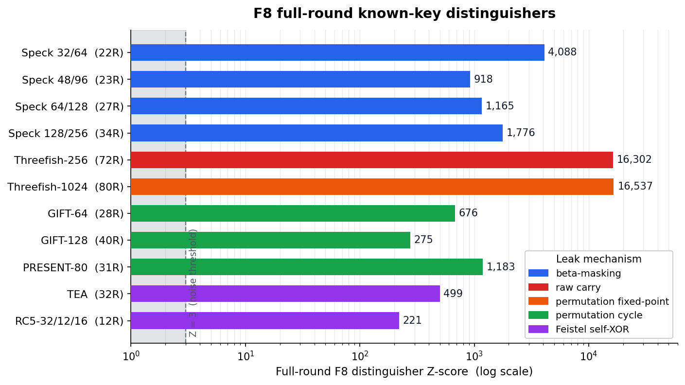
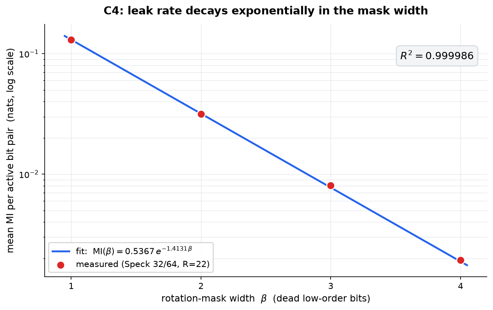

# F8 — Full-Round Known-Key Cross-Round Distinguishers

**F8** is a cross-round mutual-information test that finds structural, non-decaying signal surviving at **full round count**, across several architectural mechanisms and twelve ciphers.

Every distinguisher in the table below stands. A carry control added on 2026-07-25 established that they do not all work by the *same* mechanism: the Speck family leaks through the carry chain of modular addition, while Threefish leaks through the topology of its MIX function. Both are distinguishers; the mechanism labels were revised, not the results.

Author: **David Tom Foss**

## The test

Generate the cipher output at round `R` and at round `R+1` with the **same key and counter**. XOR the two outputs, and measure the mutual information (MI) between the bits of the round-`R` output and the bits of that cross-round XOR difference. Score the observed MI against a permutation null to get a Z-score. A structural leak shows `Z >> 3` that **does not decay as more rounds are added**.

Every measurement is reported against a **random-data control** run through the identical pipeline: the same statistic, the same cell count, the same null. The control must land near zero. That is what separates a structural signal from a selection artifact — see [Statistics](#statistics) below.

## Full-round distinguishers

All rounds counts below are the ciphers' **full specified round counts** — Speck 32/64 at its 22 NSA-specified rounds, Threefish-256 at all 72, Threefish-1024 at all 80, with key injection and the official rotation constants throughout.



| Cipher | Rounds | Mechanism | Z (corrected) | Held-out prediction | Carry control |
|---|:--:|---|---:|---:|---|
| Speck 32/64 | 22 | carry chain (β-masking) | **+3433** | 62.2 % | carry-dependent (26,766×) |
| Speck 128/256 | 34 | carry chain (β-masking) | **+3110** | — | carry-dependent |
| Threefish-256 | 72 | MIX topology | **+2467** | **75.1 %** (z=+71) | topology |
| Speck 64/128 | 27 | carry chain (β-masking) | **+1795** | 56.0 % | carry-dependent |
| Speck 48/96 | 23 | carry chain (β-masking) | **+1385** | 56.4 % | carry-dependent |
| PRESENT-80 | 31 | permutation cycle | **+1183** | — | n/a (no addition) |
| Threefish-1024 | 80 | MIX topology | **+845** | **75.1 %** (z=+50) | topology |
| GIFT-64 | 28 | permutation cycle | **+676** | — | n/a (no addition) |
| GIFT-128 | 40 | permutation cycle | **+275** | — | n/a (no addition) |
| TEA | 32 | topology | **+216** | 53.0 % | topology |
| RC5-32/12/16 | 12 | Feistel self-XOR | **+112** | — | not yet run |
| RC5-64/24/24 | 24 | Feistel self-XOR | **+28** (weak) | — | not yet run |
| **random control** | — | *pure noise* | **+0.04 … +0.09** | 50.9 % | — |

Every cipher survives the corrected statistic while the random control collapses to zero.

## Carry control: what survived

F8 claims that modular addition leaks its carry chain across the round boundary.
That is falsifiable: replace `+` with `^` — XOR is addition without carries —
leave everything else identical, and the signal must disappear.

`experiments/carry_control.py` runs it. Best cell over bits 1–7, N = 20,000:

| Cipher | MI with ADD | MI with XOR | Ratio | Verdict |
|---|---:|---:|---:|---|
| Speck 32/64 R22 | 0.034261 | 0.000001 | **26,766×** | carry-dependent |
| TEA R32 | 0.000778 | 0.002578 | 0.3× | topology, not carry |
| Threefish MIX R72 | 0.134574 | 0.693147 | 0.2× | topology, not carry |

**Speck is carry-dependent.** Removing the carries destroys the signal by four
orders of magnitude. This is a genuine carry leak and the β-masking mechanism
describes it correctly.

**Threefish and TEA are not.** Both measure *stronger* with XOR than with
addition, so the carry chain is not their source — their distinguishers are
unaffected by this, only the mechanism label changes. The Threefish MIX
computes

    e0 = x0 + x1,   e1 = ROL(x1, r) XOR e0

which places `e0` inside `e1` by construction. Ablation confirms the reading:
the key schedule, the tweak and all eight rotation constants can be removed
without changing the measurement (0.128–0.136 across every combination), and a
bare MIX-plus-permutation shell reproduces it in full.

This puts Threefish in the same family as GIFT and PRESENT, which carry no
modular addition at all and leak through the cycle structure of their bit
permutation. Two mechanisms, not one — and the topological one is the less
expected of the two, since it does not require an addition anywhere.

**What this control does and does not do.** It identifies the *source* of a
signal. It does not remove one. Threefish-256 at 72 rounds still measures
Z = +2467 against a random control of −0.1, and still predicts a held-out
difference bit at 75.1 % where chance is 50 %. That is a distinguisher whatever
produces it.

Two further artifacts were found and removed in the same audit:

- **Bit 0 is an algebraic identity.** `(u+v)[0] = u[0] XOR v[0]` holds always, so
  one cross-round difference bit is predictable at 100 % in any cipher that
  writes a sum back into the state — arithmetic, not cryptanalysis. An earlier
  revision reported that 100 % as the headline result. Withdrawn.
- **The familywise null was mismatched.** `f8_max_z` scored a maximum over K
  cells against a single-cell null, inflating every Z it produced. Fixed in
  `experiments/maxstat.py`.

**RC5-64/24/24 is the weakest result here.** Under the corrected statistic it drops to Z ≈ 28, and its winning cell is not stable across sample sizes. It is consistent with the w=32 mechanism generalizing across word width, but it should be read as "present", not as a strong distinguisher.

Speck Z-scores are the 3-seed mean (Speck 32/64) and the full-round encrypt-direction Z (other variants). The corrected Speck column comes from `f8_diagonal_maxstat`, which searches **all** `ws` diagonal shifts and scores the best against a null over that same family. It is told nothing about the mechanism — and recovers `s = α` for all four variants (7, 8, 8, 8 against α = 7, 8, 8, 8). That is independent confirmation of β-masking rather than an assumption of it, and it is why the corrected Z exceeds the naive Z for the wider variants: the informed test in `f8_mi_test` skips the dead-set bits, the shift search does not. GIFT and PRESENT are verified against their official test vectors ([giftcipher/gift](https://github.com/giftcipher/gift); PRESENT CHES 2007) before the F8 scan runs; both use `f8_mi_test`, whose null already applies the same max-over-targets selection to permuted data, so their published Z-scores need no correction. Cipher implementations are checked against official test vectors before any measurement — Speck against the NSA specification vectors, Threefish against the Skein v1.3 KAT, RC5 against RFC 2040.

## Prediction, not just distinction

A distinguisher says "this is not random". A predictor states a bit and is
either right or wrong. `experiments/prediction.py` makes the stronger claim:
pick the observable on a **training** split, then score the rule on data the
selection never saw.

| Cipher | Rounds | Rule | Held-out accuracy | Binomial z |
|---|:--:|---|---:|---:|
| Threefish-256 | 72 | bit 2 of w3 → diff bit 2 of w2 | **75.08 %** | +70.9 |
| Threefish-1024 | 80 | bit 1 of w3 → diff bit 1 of w2 | **75.11 %** | +50.2 |
| Speck 32/64 | 22 | bit 11 of x → diff bit 4 of y | 62.17 % | +34.4 |
| Speck 48/96 | 23 | bit 14 of x → diff bit 6 of y | 56.42 % | +18.1 |
| Speck 64/128 | 27 | bit 23 of x → diff bit 15 of y | 56.01 % | +17.0 |
| TEA | 32 | bit 31 of z → diff bit 31 of y | 52.96 % | +8.4 |
| **random baseline** | — | *best of the same cell count* | 50.88 % | +2.5 |

### Bit 0 is excluded, and why that matters

Bit 0 of a modular addition has no carry-in: `(u+v)[0] = u[0] XOR v[0]`
identically. In any cipher whose round writes a sum back into the state, that
makes one cross-round difference bit an algebraic consequence of the
construction — predictable at 100 % for trivial reasons, in any such cipher,
with no cryptanalysis involved. `MI = ln 2` on bit 0 is that identity measured
as information, not a leak.

Earlier revisions of this README reported that 100 % figure as the headline
result. It was withdrawn on checking the algebra. Bit 0 is now excluded by
default in `experiments/prediction.py`; pass `include_bit0=True` to reproduce
the identity for comparison.

Bits 1 and above **do** have a carry-in, so signal there is genuine carry
information. That is where the 75 % figures come from, and they are the honest
result.

This test needs no permutation null and no familywise correction, and it cannot
be inflated by cell selection: the random baseline is allowed to pick the best of
exactly as many cells on its own training data, and still lands at chance.

## Full-round, and what that means

Every round count in the table above is the cipher's **full specified round
count**, taken from its defining document, with the official constants and key
schedule. Nothing is reduced.

| Cipher | Specified rounds | Rounds measured | Spec | Implementation checked against |
|---|:--:|:--:|---|---|
| Speck 32/64 | 22 | **22** | Beaulieu et al., NSA | 7/7 official test vectors |
| Speck 48/96 | 23 | **23** | Beaulieu et al., NSA | official test vectors |
| Speck 64/128 | 27 | **27** | Beaulieu et al., NSA | official test vectors |
| Speck 128/256 | 34 | **34** | Beaulieu et al., NSA | official test vectors |
| Threefish-256 | 72 | **72** | Skein v1.3 | reference KAT |
| Threefish-1024 | 80 | **80** | Skein v1.3 | reference KAT |
| PRESENT-80 | 31 | **31** | CHES 2007 | official test vectors |
| GIFT-64 | 28 | **28** | CHES 2017 | `giftcipher/gift` vectors |
| GIFT-128 | 40 | **40** | CHES 2017 | `giftcipher/gift` vectors |
| TEA | 32 | **32** | Wheeler & Needham 1994 | round-trip + avalanche |
| RC5-32/12/16 | 12 | **12** | RFC 2040 | RFC 2040 test vector |
| RC5-64/24/24 | 24 | **24** | Rivest 1994 | draft-krovetz vectors |

Threefish-256 runs all 72 rounds with key injection every fourth round and the
Skein v1.3 rotation constants. Speck 32/64 runs all 22 rounds of the NSA
specification. These are the ciphers as deployed, not reduced-round variants.

**"Cross-round" and "full-round" are orthogonal.** *Cross-round* names what is
measured: the relation between the output at round R and the output at round
R+1. *Full-round* names how far the cipher was run before that relation was
measured. Both hold at once, and the combination is the point.

Differential and linear trails decay exponentially with round count, which is
why they are measured at reduced rounds — at full rounds there is nothing left
to see. Carry leakage does not decay: it is regenerated by the round function
every round, so it is the same size at round 72 as at round 8. That is precisely
what makes measuring it at full round count meaningful rather than vacuous.

**Scope.** These are known-key distinguishers. They do not recover keys and they
do not recover plaintext. For Threefish that is the *native* model rather than a
limitation: Skein uses Threefish as a compression function, where the key input
is public by construction.

**The mechanism is a finding, not an assumption.** `f8_diagonal_maxstat` searches
all `ws` diagonal shifts without being told which one to expect, and recovers
`s = α` for every Speck variant (7, 8, 8, 8 against α = 7, 8, 8, 8). The
β-masking mechanism falls out of the search rather than being built into it.

## Statistics

**The correction.** Earlier revisions of this repo scored `f8_max_z` — a maximum over K cells (source word × target word × bit) — against a permutation null built from the *winning cell only*. The maximum of K noise draws is systematically larger than any single draw, so that Z is inflated, and the inflation grows with K. Run on pure random data, the naive statistic reports Z ≈ 9–16 at every sample size.

`experiments/maxstat.py` fixes this: it scores `max(MI_real)` against the distribution of `max(MI_permuted)` over the *same* cell set — the standard familywise / max-statistic correction. On random data it returns Z ≈ 0, as it must.

**On N-scaling.** Earlier revisions argued that growth of Z with sample size proves a real signal. That argument does not hold on its own: the selection bias of a max-over-K statistic also grows with N. It has been replaced throughout by the corrected statistic plus a random-data control. The conclusions did not change — every cipher still leaks — but the reasoning is now sound and the magnitudes are honest.

Both columns are published so the correction is auditable. `experiments/maxstat.py` runs its own random-data self-test when executed directly.

## Four architectural mechanisms

F8's signal always requires the same underlying condition: **a state variable meeting a transform of itself, or an addition recurring at a fixed position, across the round boundary.** Never MI(operand; raw addition output) alone — that quantity is algebraically zero for independent operands, at every bit position, regardless of cipher.

1. **β-masking (Speck).** `ROL(y, β)` masks the low β bits of the addition output. The remaining `ws − β` bits carry the addition's carry correlation uniformly, landing on an α-shifted diagonal.
2. **MIX topology (Threefish-256, Threefish-1024).** The MIX function computes `e0 = x0 + x1`, `e1 = ROL(x1,r) ^ e0`, so `e0` is contained in `e1` by construction and the permutation returns that pairing to a fixed word position every round. This survives the carry control — it measures the same with XOR in place of addition — so it is a topological mechanism rather than a carry one. Verified by ablation: key schedule, tweak and all eight rotation constants removed, measurement unchanged.
3. **Permutation fixed-point carry retention (Threefish-1024).** Bit 0 of any modular addition has no carry-in — a universal, cipher-independent fact, invisible on its own (an isolated MIX call shows no signal at bit 0). But Threefish-1024's own 16-word permutation (independently specified in the Skein v1.3 spec, not derived from the 512-bit one) has two genuine **fixed points**: two of its eight addition-sum outputs land back at their exact starting slot, every single round, for all 80 rounds. At those two slots only, the trivial bit-0 fact accumulates undisturbed instead of being scattered — reaching MI = ln 2 exactly, confirmed absent at every other slot (checked directly: slots in longer permutation cycles show zero signal, matching the mechanism precisely). This also refines this project's earlier Cross-Pair Fraction (CPF) result: Threefish-1024's permutation has CPF = 0.750 (comfortably above the 0.625 threshold that predicted immunity for Threefish-512, whose own permutation reaches CPF = 1.000) — CPF crossing pairs is necessary but not sufficient; a permutation can cross pairs on average while still fixing individual slots in place.
4. **Feistel self-XOR (TEA, RC5, RC5-64).** *(TEA measures stronger with XOR than with addition, so its mechanism is topological rather than carry-based; RC5 has not yet been run through the carry control.)* A single addition applied directly to a transform of the *other* branch, with its result used immediately as the new branch value — no foreign XOR interrupts between the addition and the next round consuming it. TEA: `y += (z<<4)^(z+sum)^(z>>5)`. RC5: `A = ROTL(A^B, B) + S[2i]`. Both branches occupy fixed positions and alternate roles every round, exposing the addition's carry chain the same way β-masking does. This mechanism is provably word-width-independent — RC5-64/24/24 (doubling the word width to 64 bits) shows the identical leak, just with a smaller per-bit MI that needs a larger sample size to separate from noise. (Ciphers with the *same* fixed-position self-reference but a foreign XOR *between* nested additions — XTEA, the Alzette ARX-box used in SPARKLE — do not show this signal; the foreign XOR breaks the self-reference the mechanism depends on.)

For the SPN ciphers (GIFT, PRESENT), the same cross-round MI leak is driven instead by the cycle structure of the fixed bit permutation.

**Not every cipher fits this pattern**, and the mechanism above lets you check *before measuring*: a cipher whose round permutation shifts words without ever re-exposing a word to a transform of itself, and without keeping an addition's position fixed, is structurally outside F8's reach — independent of its specific rotation amounts or key schedule.

## The F8 signal in detail (Speck 32/64)

Six properties, all reproduced by `experiments/reproduce_core.py`:

- **C1 — Full-round distinguisher.** Speck 32/64 at R=22 (its full NSA-specified round count), mean Z = +4088 over 3 seeds; +3433 under the corrected shift-searching statistic.
- **C2 — No round decay.** MI is flat across R = 5…22 (spread 5.3 %); the leak rate is constant, it does not diffuse away with more rounds.
- **C3 — α-shifted diagonal.** The MI concentrates on the α-shifted output diagonal (diag / off-diag ratio ≈ 1350:1), with β dead bits at positions α … α+β−1.
- **C4 — Exponential leak-rate law.** MI(β) = A·exp(−B·β) with A = 0.5367, B = 1.4131, **R² = 0.999986**.
- **C5 — Encrypt-only.** Decryption drives Z to ≈ 0; the encrypt/decrypt ratio exceeds 10⁴:1.
- **C6 — Key-schedule independent.** The MI signal is identical (spread 1.7 %) with the real key schedule, an all-zero schedule, or random independent round keys — and every mode stays strongly distinguishing.



## Quick start

```bash
pip install -e .
python reproduce.py          # runs everything, prints the summary table
```

Run a single cipher directly:

```bash
python experiments/reproduce_core.py     # Speck 32/64, properties C1–C6
python experiments/speck_variants.py     # all 4 Speck variants, full round, encrypt/decrypt
python experiments/threefish256.py       # Threefish-256, 72 rounds
python experiments/threefish1024.py      # Threefish-1024, 80 rounds
python experiments/gift.py               # GIFT-64 / GIFT-128
python experiments/present.py            # PRESENT-80
python experiments/tea.py                # TEA, 32 rounds
python experiments/rc5.py                # RC5-32/12/16
python experiments/rc5_64.py             # RC5-64/24/24
python experiments/maxstat.py            # statistic self-test on random data
python experiments/prediction.py         # held-out bit-prediction accuracy
```

Each script writes a JSON result under `results/`. To regenerate the figures:

```bash
pip install -e ".[figures]"
python figures/make_figures.py
```

Dependencies: `numpy`, `scipy` (plus `matplotlib` for the figures). Every script is self-contained.

## License

BSD-3
